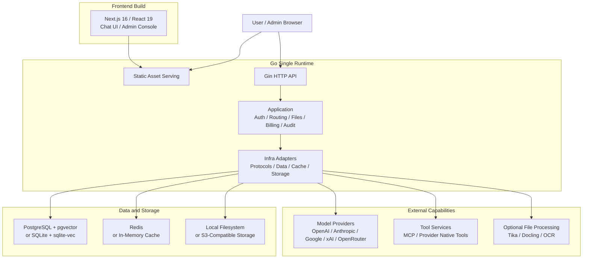

<p align="center">
  <picture>
    <source media="(prefers-color-scheme: dark)" srcset="./frontend/public/logo-white.svg" />
    
  </picture>
</p>

<p align="center">
  <b>X-DEEIX</b> —— 基于 <a href="https://github.com/DEEIX-AI/DEEIX-Chat">DEEIX-Chat</a> 的定制分支：角色协作 · 长期记忆 · 卡片与制品 · AI 工作空间操作 · 多模态工具
</p>

<p align="center">
  <a href="https://www.apache.org/licenses/LICENSE-2.0"></a>
  
  
  
</p>

## 镜像（GitHub Container Registry）

制品镜像发布在 GitHub 的容器镜像源（ghcr.io），在仓库 Packages 页面可查看：

```
ghcr.io/anglenaris/x-deeix:custom     # custom 分支构建（本定制版）
ghcr.io/anglenaris/x-deeix:<tag>      # 生产部署必须 pin 精确 tag，禁止默认拉取 :latest（流程见 docs/CUSTOM_DEPLOYMENT.md）
```

## 本定制版的新增功能

X-DEEIX 在标准版的对话、模型路由、知识库和账户能力之上，增加了以下面向个人创作者、专业用户与小型协作团队的产品能力。

> 部分能力受管理员运行时开关、已授权工具、模型协议或专用模型配置影响。Agent Groups、MCP、语义记忆召回和多模态委托在新部署中默认不会全部自动开启，实际可用范围以管理后台与当前模型能力为准。

### 角色、协作与工作空间

| 功能 | 说明 |
| --- | --- |
| **角色管理与快捷对话** | 创建、编辑、复制和删除角色；为角色设置专属指令、默认模型、技能、工具与思考强度，并从角色入口直接开始继承完整配置的新对话 |
| **角色分组、排序与置顶** | 角色可分组、折叠、拖拽排序和置顶，布局持久保存，适合管理大量专业角色 |
| **Agent Groups 多角色协作** | 一个统筹角色与最多 31 个执行成员在同一会话中串行协作；支持成员职责、模型覆盖、配置快照、实时步骤轨迹、取消、失败步骤原地重试与刷新后恢复。功能由管理员开关控制，默认关闭；详细说明见 [`docs/AGENT_GROUPS.md`](./docs/AGENT_GROUPS.md) |
| **技能与技能包** | 创建和管理普通技能；导入 ZIP 技能包前可预览 `SKILL.md` 元数据与文件清单，并支持导入、替换和重新导入 |
| **动态提示词与脚本** | 管理命名文本或 JavaScript 片段，通过 `{{script: name}}` 复用；角色与项目提示词编辑器可快捷插入系统变量、动态提示词和脚本 |
| **系统提示词变量** | 支持 `{{date}}`、`{{time}}`、`{{datetime}}`、`{{weekday}}`、`{{language}}`、`{{username}}`、`{{js: 代码}}` 等变量，时间按用户时区渲染 |
| **定制导航与管理页面** | 侧边栏提供文件、卡片、制品、知识库、技能和群组等稳定入口，并为长期资产提供独立管理页面 |
| **主题、显示与时区偏好** | 保留定制主题、模型列表样式与排序等个人偏好，并自动同步浏览器时区，让提示词变量和界面时间按用户所在地显示 |

### 上下文、记忆与可交付资产

| 功能 | 说明 |
| --- | --- |
| **AI 长期记忆** | AI 可保存、列出和删除 `preference`、`profile`、`custom` 三类长期记忆，用户也可手动维护；偏好记忆固定注入，其他记忆按相关性召回 |
| **记忆相关性召回** | 默认可使用关键词相关性选择记忆；启用 Embedding 后可使用向量召回，并在服务不可用、超时或失败时回退到关键词路径 |
| **历史消息语义召回** | 启用 Embedding 与语义上下文后，可从当前对话的有效历史分支补充相关消息；召回超时或不可用时会跳过，不阻塞正常回答 |
| **卡片** | 用户或 AI 创建可分类、启用/停用并绑定项目或角色的背景卡片。卡片由最新用户消息中的关键词触发，匹配不区分大小写；项目与角色同时绑定时按交集生效，每轮最多注入 5 张。卡片召回不依赖向量服务 |
| **上下文来源展示** | 对话过程区以独立卡片标记技能、工具、记忆和语义召回来源，帮助用户判断本轮回答使用了哪些背景信息 |
| **制品** | 将 HTML、JavaScript、CSS 或文本成果保存为独立制品；支持预览、修改名称/类型/源码、自动缩略图、固定宽度或全宽展示、公开分享与撤销分享 |
| **文件与媒体交付** | AI 与工具生成的文件可直接回传当前对话；图片、视频和音频在消息流或工具轨迹中内联预览，其他文件以可打开或下载的附件卡片展示 |

### AI 执行、工具与安全

| 功能 | 说明 |
| --- | --- |
| **平台工具（Platform Tools）** | AI 可在用户权限范围内管理文件、技能、角色、项目、群组、会话、记忆、卡片、制品、提示词与设置，也可运行纯计算 JavaScript、生成图片；管理员可整体关闭、设为只读或开放写入 |
| **写操作审批与审计** | 普通写操作支持“自动允许”或“每次询问”；询问模式会展示批准/拒绝卡片，拒绝后不修改目标内容。操作过程保留审计记录 |
| **凭据管理** | 在“设置”中保存和轮换 SSH、API Key 等命名凭据；密钥加密存储且不会在列表、确认卡、会话轨迹或公开分享中回显。模型使用名称与占位符选择凭据，执行时才在内存中解析 |
| **管理员能力控制** | 管理员可控制 Agent Groups、平台工具读写、写操作默认审批方式、模型能力与展示顺序等运行时边界；关闭功能不会删除用户已有资产 |
| **工具按需启用** | 仅向 AI 暴露用户已授权且当前激活的 MCP 服务和工具；任务需要新服务时可在同一轮完成激活并继续执行，恢复或群组重试可保持已确认的工具状态 |
| **隔离任务空间** | 配套沙箱按用户与会话建立独立容器、工作区、导入目录和导出范围，可运行 shell、Python、ffmpeg、数据分析及依赖安装，并通过标准附件链把结果文件交回对话 |
| **多模态委托与降级** | 主模型无法直接处理媒体时，可将用户授权的当前或历史图片、音频、视频委托给专用模型或 MCP 工具，完成读图、OCR、ASR、视频理解等任务；需要管理员配置对应路由或工具 |

### 生成控制、过程展示与连续性

| 功能 | 说明 |
| --- | --- |
| **思考强度控制** | 统一提供默认、低、中、高、超高和最大档位，并按 OpenAI、Anthropic、Gemini 等协议映射到当前模型可接受的参数 |
| **图片生成与连续改图** | 支持画面比例、1K/2K/4K 分辨率及模型可用的质量参数；使用图片编辑模型时，可在下一轮用纯文字继续修改上一张生成图 |
| **实时思考与工具轨迹** | 当上游协议返回流式 reasoning 事件时，思考内容会在生成过程中实时增长，不必等待最终回答完成；工具调用、群组步骤和媒体结果使用统一过程卡展示 |
| **生成流恢复** | 生成事件支持快照、增量订阅、短期回放、取消和终态保存，刷新或短暂断线后可恢复已接收内容，避免重复显示事件 |
| **中断续写与任务恢复** | 普通对话可从未完成回复继续生成；群组任务持久化步骤和尝试记录，可从失败步骤恢复而不重复已完成阶段 |
| **分享脱敏** | Agent Groups 的公开分享和默认导出仅保留用户消息、统筹角色最终结果及必要元数据，不公开成员内部指令、推理、工具输入、凭据或调试信息 |

## 配套 MCP 服务（沙箱 / 多模态）

仓库包含一个多用户隔离沙箱和两个 Qwen 多模态隔离代理。部署后在管理后台“工具”页注册为 MCP Server，并由用户或项目/角色授权后使用。工具数量可能随上游插件版本变化，应以部署环境的 `tools/list` 结果为准。

| 服务 | 默认端点 | 主要能力 |
| --- | --- | --- |
| `deeix-sandbox-mcp` | `:8081/mcp` | 13 个沙箱工具：同步命令、后台任务、文件读写与列表、安全下载、文件导出、会话镜像切换、进程查看/终止和工作区重置 |
| `qwen-mm-core` | `:8082/mcp` | 图片/视频读取、媒体信息、OCR、视觉问答与定位、裁切/标注、语音转写、搜索等核心多模态能力 |
| `qwen-mm-omni-av` | `:8083/mcp` | 音频和视频的 ASR、时间戳、多说话人识别、描述、定位、计数和音乐理解 |

**沙箱与多模态文件互通**：应用、沙箱 MCP 与多模态代理使用部署机上的受控目录，通过 `/shared/deeix-<user>-<conversation>` 范围交换文件。每次调用携带后端签名的用户、会话、请求与调用信息；代理只允许访问当前签名范围，不会把完整租户目录挂载进会话容器。

**DEEIX 侧配套能力**：上传支持音频；MCP 工具可按配置接收 image/audio/file 附件；工具返回的 image/audio/video 内容可进入消息附件链，前端过程卡和消息流支持对应媒体预览。

**部署与验收**：部署文件位于 `tools/sandbox-mcp/deploy/`。启用前必须完成网络隔离、跨范围访问拒绝、附件导入、`sandbox_export_file` 文件交付和多模态 `tools/list` 冒烟检查；详细说明见 [`tools/sandbox-mcp/README.md`](./tools/sandbox-mcp/README.md) 与 [`tools/mm-isolation/README.md`](./tools/mm-isolation/README.md)。

## 部署方式

### 方式一：Docker Compose（推荐）

```bash
docker pull ghcr.io/anglenaris/x-deeix:latest
```

`docker-compose.yml`：

```yaml
name: x-deeix

services:
  app:
    image: ghcr.io/anglenaris/x-deeix:latest
    container_name: x-deeix-app
    restart: unless-stopped
    ports:
      - "127.0.0.1:8088:8080"   # 反代到域名时建议只监听本机
    volumes:
      - ./config.yaml:/app/config.yaml:ro
      - x-deeix-storage:/app/storage
      - x-deeix-data:/app/data
    networks:
      - x-deeix-net

volumes:
  x-deeix-storage:
  x-deeix-data:

networks:
  x-deeix-net:
```

`config.yaml` 关键项（首次启动生成默认配置，正式部署必须修改）：

```yaml
server:
  public_web_base_url: "https://your-domain.com"   # 对外访问域名（分享链接、邮件链接使用）
  public_api_base_url: "https://your-domain.com"
  secret_key: "换成随机密钥"                        # JWT / 敏感数据加密
database:
  driver: "sqlite"                                  # 或 postgres
```

启动：

```bash
docker compose up -d
```

数据持久化在 Docker 卷 `x-deeix-storage`（上传文件）与 `x-deeix-data`（SQLite 数据库）。

### 方式二：从源码构建

```bash
# 后端
cd backend && go build -o ../bin/deeix-chat . && cd ..
# 前端
cd frontend && pnpm install && pnpm build && cd ..
# 自定义镜像
docker build -t x-deeix:local .
```

## 分支说明

| 分支 | 说明 |
| --- | --- |
| `dev` | 上游基线线：与上游 DEEIX-Chat 同步（upstream/dev），**不承载定制开发** |
| `custom` | 定制版功能开发分支（当前版本基于此分支构建、部署、发布 ghcr） |

### 代码布局（worktree）

本仓库使用两个 git worktree，分支不重叠：

| 目录 | 检出分支 | 职责 |
| --- | --- | --- |
| `C:\_MY_WORK\DEEIX-Chat` | `dev` | 上游基线（同步 upstream/dev） |
| `C:\_MY_WORK\X-DEEIX-custom` | `custom` | 定制开发、构建部署镜像 |

同一分支只能在一个 worktree 检出——在 custom worktree 里 `git checkout dev` 会报「目标分支已在其他 worktree 中被检出」；要操作 dev 请到主目录。

### 开发规范（必读）

**所有自定义功能必须在 `custom` 分支上开发**，禁止直接在 `dev` 分支开发定制功能：

1. **开发**：在 `custom` 分支（独立 worktree）检出、提交。任何定制改动（后端功能、前端 UI、平台工具、i18n、配置等）先提交到 `custom`。
2. **上游同步**：需要跟进上游时，把 `upstream/dev` / `dev` 合并进 `custom`，而不是在 `dev` 上做定制提交。`dev` 分支只保留上游内容与必要的基线修复。
3. **合并方向**：`dev → custom`（上游进定制线）。不反向合并定制到 `dev`，除非该改动是上游也需要的通用修复（此时先在 `dev` 提交再合入 `custom`，保持两条线一致）。
4. **发布**：以 `custom` 分支为准 —— VPS 镜像由 custom worktree 构建，ghcr workflow 用 `--ref custom`，线上只认 custom 内容。
5. **合并冲突**：`dev → custom` 产生冲突时，定制功能优先保留 `custom` 侧实现；上游通用修复优先保留 `dev` 侧实现；无法判断时以线上已部署行为为准并记录决策。
6. **提交规范**：定制提交信息用中文说明改动目的，涉及传输层契约或行为变更的必须同步更新测试。

---

<details>
<summary><b>📖 原版 README（上游 DEEIX-Chat）</b> —— 点击展开</summary>

<p align="center">
  <picture>
    <source media="(prefers-color-scheme: dark)" srcset="./frontend/public/logo-white.svg" />
    
  </picture>
</p>

<p align="center">
  An integrated AI platform for enterprise model routing, chat, files, tools, billing, identity, and operations.
</p>

<p align="center">
  English | <a href="./docs/README.zh-CN.md">简体中文</a>
</p>

<p align="center">
  <a href="https://deeix.com"></a>
  <a href="https://deeix.com/docs/deeix-chat/quickstart"></a>
  <a href="https://t.me/deeix_chat"></a>
  <a href="https://x.com/DEEIX_AI"></a>
  <a href="https://www.apache.org/licenses/LICENSE-2.0"></a>
  
  
  
</p>

## Overview

DEEIX Chat is an open-source, deployable AI platform for individuals, teams, and enterprises that need long-term, stable, and unified access to multiple model providers. It provides one clear entry point for multiple upstream models and providers, integrating multimodal chat, model routing, files and RAG, MCP tools, usage billing, identity, audit logs, and operational controls into one product.

The system is designed around simple deployment, efficient static delivery, and a low runtime resource footprint: lightweight without feeling limited, restrained without losing capability, and open without becoming disorderly.


## Features

| Area | Capabilities |
| --- | --- |
| Conversations | A multimodal chat interface for daily use, with streaming, branches, retries, edits, feedback, sharing, rich rendering, and traceable model execution metadata. |
| Agent Groups | Multi-agent conversations with a supervisor and worker members, serial step execution, per-member model overrides, in-place step retry with attempt history, and crash recovery. See [Agent Groups guide](docs/AGENT_GROUPS.md). |
| Models and routing | A platform-model layer for upstream channels, real models, route bindings, priority, weights, circuit breaking, vendor mapping, and capability configuration, reducing the cost of multi-provider operations. |
| Protocols and adaptation | Unified support for OpenAI, Anthropic, Google/Gemini, xAI, OpenRouter, and OpenAI-compatible protocols across text, image, tools, and provider-native capability differences. |
| Files and retrieval | File upload, preview, extraction, OCR, storage quota, full-context injection, chunking, embeddings, and semantic retrieval so file content can naturally enter the conversation context. |
| Tool ecosystem | MCP servers and provider-native official tools with discovery, enablement, user selection, execution limits, result rendering, and tool-call traceability. |
| Context and memory | Message windows, token budgets, summary compression, conversation memory, long-term memory, and RAG evidence records for controlled-cost continuity. |
| Billing and payments | Model pricing, per-call tool pricing, subscriptions, top-ups, balances, usage ledgers, billing snapshots, Stripe Checkout, EPay, and webhook validation. |
| Identity and security | Local accounts, session management, HttpOnly refresh cookies, 2FA/TOTP, trusted devices, SSO/OIDC/OAuth, contact verification, and encrypted sensitive data. |
| Administration and audit | Centralized management for users, roles, upstreams, models, routes, pricing, subscriptions, balances, usage logs, audit logs, auth events, and system events. |
| Deployment and operations | Single-runtime frontend/API serving, Docker deployment, SQLite or PostgreSQL, in-memory cache or Redis, S3-compatible storage, Swagger, structured logs, version endpoint, GeoIP, and OpenTelemetry. |

<p align="center">
  
  
</p>

<p align="center">
  
  
  
</p>

## Architecture and Tech Stack

DEEIX Chat uses a split frontend/backend development model with a single-runtime deployment path. The frontend is built into static assets and served by the Go service, while APIs, authorization, model routing, files, billing, and audit capabilities run in the same backend runtime. Heavy document extraction and OCR capabilities are optional services, keeping the base deployment lightweight.



| Layer | Responsibility | Technologies |
| --- | --- | --- |
| Frontend | Chat UI, admin console, and static builds | Next.js 16, React 19, TypeScript, Tailwind CSS, Shadcn/UI, Streamdown, KaTeX, Mermaid, Recharts, Motion |
| Backend runtime | APIs, authentication, authorization, orchestration, protocol adaptation, and static serving | Go 1.26, Gin, Gorm, Swagger, OpenTelemetry, Zap |
| Data and cache | Domain data, vector retrieval, session state, and runtime cache | PostgreSQL, pgvector, SQLite, sqlite-vec, Redis, in-memory cache |
| Files and storage | Uploaded files, generated files, object storage, and local persistence | Local filesystem, S3-compatible object storage |
| File processing | Text extraction, OCR, document parsing, and LLM OCR fallback | Built-in extractors, Apache Tika, Docling, RapidOCR, Tesseract OCR, Paddle OCR, cloud OCR adapters, MinerU |
| Tool protocol | MCP tool integration and provider-native official tools | MCP Streamable HTTP JSON-RPC, provider-native tools |
| Deployment runtime | Lightweight single-node deployment or multi-node production deployment | Docker, Docker Compose, SQLite/in-memory cache, PostgreSQL/Redis |

The backend keeps clear internal boundaries: `cmd/internal/cli` handles entrypoints, `internal/app` assembles the application, `transport/http` owns the HTTP boundary, `application` coordinates use cases and transactions, `domain` expresses business semantics, and `infra` contains database, cache, storage, and external protocol implementations. The data layer uses domain-prefixed tables, while financial records, audit trails, system events, and high-growth vector data remain separate sources of truth.

## Quick Start

> Quick installation guide: [Quick Start](https://deeix.com/docs/deeix-chat/quickstart).

### Local Development

Local development is intended for editing source code and running the frontend and backend separately. The default config connects to local PostgreSQL and Redis. If you only want a low-dependency trial, use the lightweight Docker installation below.

1. Prepare backend configuration:

```bash
cp config.example.yaml config.yaml
```

Adjust `database.postgres.dsn`, `database.redis.*`, and public URLs in `config.yaml` for your local environment.

2. Install workspace dependencies and prepare the frontend environment:

```bash
pnpm install
cp frontend/.env.example frontend/.env.local
```

3. Start the frontend and backend together:

```bash
pnpm dev
```

Use `pnpm dev:web` or `pnpm dev:api` to start only one workspace.

The frontend uses `NEXT_PUBLIC_API_BASE_URL` for API requests. For local development, confirm that `frontend/.env.local` contains:

```env
NEXT_PUBLIC_API_BASE_URL=http://127.0.0.1:8080
```

URLs:

| Service | URL |
| --- | --- |
| Frontend | `http://localhost:3000` |
| API | `http://localhost:8080` |
| Swagger | `http://localhost:8080/swagger/index.html` |

If `NEXT_PUBLIC_API_BASE_URL` is omitted, local development defaults to `localhost:8080`; same-origin deployments use the current origin.

### Docker Deployment

Choose one installation profile first, then copy the matching config file. All root compose profiles expose the app at `http://localhost:8080` by default and mount the repository-level `config.yaml` to `/app/config.yaml` inside the container.

| Profile | Use case | Config file | Compose file | Built-in dependencies |
| --- | --- | --- | --- | --- |
| Lightweight | Local evaluation, personal use, small single-node deployments | `config.sqlite.example.yaml` | `docker-compose.sqlite.yml` | App only, SQLite + sqlite-vec + in-memory cache |
| Default | External PostgreSQL and Redis already exist | `config.example.yaml` | `docker-compose.yml` | App only |
| Full | Single-machine stack with app, PostgreSQL, and Redis | `config.full.example.yaml` | `docker-compose.full.yml` | App, PostgreSQL, Redis |

#### 1. Lightweight Installation: SQLite

This is the lowest-dependency deployment. It starts only the `app` container, stores data and local vector indexes in SQLite, and uses the in-process memory cache. Use it for local evaluation, personal deployments, and small single-node setups.

```bash
cp config.sqlite.example.yaml config.yaml
docker compose -f docker-compose.sqlite.yml up -d
```

SQLite + memory cache is single-process only. It is good for local use, evaluation, and small single-node deployments. Use PostgreSQL + Redis for multi-node or high-concurrency production deployments.

#### 2. Default Installation: External PostgreSQL + Redis

Use this when PostgreSQL and Redis are already managed outside this compose stack. Before starting, set database and Redis addresses to values reachable from inside the container; if the services run on the Docker host, `host.docker.internal` is usually the right hostname.

```bash
cp config.example.yaml config.yaml
# Edit database.postgres.dsn, database.redis.*, and public URLs.
docker compose up -d
```

The default `docker-compose.yml` starts only the application container. Keep compose `environment` empty unless you intentionally want environment variables to override `config.yaml`.

#### 3. Full Installation: PostgreSQL + Redis Containers

Use this when you want compose to start the app, PostgreSQL, and Redis together.

```bash
cp config.full.example.yaml config.yaml
docker compose -f docker-compose.full.yml up -d
```

`docker-compose.full.yml` sets `POSTGRES_DSN`, `REDIS_ADDR`, `REDIS_USERNAME`, and `REDIS_PASSWORD` in compose `environment`, so those values override the database and Redis values in `config.yaml`.

#### Configuration, Persistence, and Image

Configuration priority is `environment variables > config.yaml > built-in defaults`. `config.yaml` is for static infrastructure and security configuration such as server URLs, database, cache, storage, GeoIP, tracing, JWT, and encryption keys. Runtime business settings are stored in the database and managed in the admin console.

The default compose files persist application data:

| Data | Container path |
| --- | --- |
| SQLite database | `/app/data/deeix.db` |
| Uploaded and generated files | `/app/storage` |
| PostgreSQL data | `/var/lib/postgresql/data`, full installation only |
| Redis data | `/data`, full installation only |

The default application image is `deeix-chat:local` (local build only). Production deployments must pin an exact tag via `docker-compose.override.yml` (see `docs/CUSTOM_DEPLOYMENT.md`) and must never pull `ghcr.io/deeix-ai/deeix-chat:latest` by default. Override it with `DEEIX_CHAT_IMAGE` when testing a custom build:

```bash
DEEIX_CHAT_IMAGE=deeix-chat:local docker compose up -d --build
```

`APP_ENV` accepts `dev`/`development` and `prod`/`production`, normalizes them to `dev` or `prod`, and defaults to `prod` when omitted. Use `dev` only for local development. Public production deployments should keep `APP_ENV=prod` or `APP_ENV=production` and use production secrets.

#### Optional Installation Services

These services are optional. Start only the ones you enable in the admin console or `config.yaml`.
They attach to `deeix-chat-network`; start one root compose profile first, or create the network manually with `docker network create deeix-chat-network`.

```bash
docker compose -f docker/tika/docker-compose.yml up -d
docker compose -f docker/tesseract/docker-compose.yml up -d --build
docker compose -f docker/docling/docker-compose.yml up -d --build
```

Default local endpoints:

| Service | URL | Purpose |
| --- | --- | --- |
| Tika | `http://127.0.0.1:9998` | Document text extraction |
| Tesseract OCR | `http://127.0.0.1:8004/ocr` | OCR service |
| Docling | `http://127.0.0.1:8005/ocr` | Document/OCR extraction |

`docker/rapidocr` currently provides a Dockerfile and app entrypoint, but no compose file. Add a compose file or run it manually if you choose RapidOCR.

### Separated Deployment

Use this mode when the frontend and backend are served from different public origins, for example `https://chat.example.com` and `https://api.example.com`.

1. Configure public URLs.

   - Frontend build variable: `NEXT_PUBLIC_API_BASE_URL=https://api.example.com`
   - Backend config: `server.public_api_base_url=https://api.example.com`
   - Backend config: `server.public_web_base_url=https://chat.example.com`
   - Backend config: `server.cors_allow_origin=https://chat.example.com`

   For Docker image builds, pass the frontend API URL at build time:

   ```bash
   docker build --build-arg NEXT_PUBLIC_API_BASE_URL=https://api.example.com -t deeix-chat .
   ```

2. Build and publish the frontend.

   ```bash
   pnpm install
   NEXT_PUBLIC_API_BASE_URL=https://api.example.com pnpm --filter @deeix/web build
   ```

   The static output is `frontend/out`. Serve it with Nginx, CDN, object storage, or any static web server. To let the Go backend serve the frontend, place `frontend/out` under `server.frontend_dist_dir`; the Docker image defaults to `/app/frontend/out`.

3. Apply CDN rules.

   | Path | Rule |
   | --- | --- |
   | `/_next/static/*` | Cache for 1 year with immutable assets enabled. |
   | `/logo*.svg`, `/*.ico`, `/*.png`, `/*.jpg`, `/*.webp`, `/*.woff2` | Cache for 1 day to 30 days. |
   | `/`, `/*.html`, `/chat*`, `/recent*`, `/files*`, `/knowledges*`, `/setting*`, `/admin*`, `/share*` | Do not long-cache. Use `no-cache` or a short TTL. |
   | `/api/*`, `/healthz`, `/readyz`, `/swagger/*` | Bypass CDN cache and forward all request headers, methods, query strings, and request bodies. |

   If the CDN serves `frontend/out` from object storage, enable route fallback so clean URLs resolve to their exported `index.html` files, for example `/chat` -> `/chat/index.html`.

### Startup Check and First Login

After the application starts, verify the health endpoint, config file, and startup logs. For Docker deployments:

```bash
curl http://localhost:8080/healthz
docker compose exec app ls -l /app/config.yaml
docker compose logs app
```

If the database does not contain a superadmin account, the backend creates the initial administrator on first startup and prints the initial password only once.

| Item | Description |
| --- | --- |
| Initial username | `admin` |
| Initial password | Inspect backend startup logs, search for `bootstrap superadmin created`, and read the `password` field. |
| First login | The system requires changing the username and password. |
| Later changes | Use the account flow or admin console; credentials are not managed through `config.yaml`. |

If a superadmin already exists, the service does not regenerate or print the initial password again.

## Configuration

> Full configuration guide: [Configuration](https://deeix.com/docs/deeix-chat/configuration).

Backend configuration is split into static runtime configuration and runtime business settings. Static runtime configuration describes branding and the infrastructure, security, and storage parameters required to start the service, and is provided through `config.yaml` and environment variables. Runtime business settings cover product capabilities such as authentication, conversations, models, files, and billing; they are stored in `system_settings` and maintained from the admin console. Environment variables override matching config-file values, which is useful for containerized deployments, separated deployments, and secret injection.

At startup, the backend resolves the default config file from the working directory: starting from the repository root reads `config.yaml`, while starting from `backend/` reads `../config.yaml`. Docker deployments usually mount host `./config.yaml` as read-only `/app/config.yaml` inside the container. If the config file is stored elsewhere, set `CONFIG_FILE` to a path accessible from the running process or container.

Frontend branding is also runtime configuration. Set the `branding` section in `config.yaml`, then restart the application; rebuilding the frontend or Docker image is not required. See [Custom branding](docs/BRANDING.md).

Static configuration environment variables:

| Area | Environment variable | Purpose |
| --- | --- | --- |
| Frontend build | `NEXT_PUBLIC_API_BASE_URL` | Browser API base URL; set in `frontend/.env.local` for local dev or at build time for separated deployment. |
| Config file | `CONFIG_FILE` | Optional config file path; Docker values should use the container path. |
| Application | `APP_NAME` | Application name. |
| Application | `APP_ENV` | Runtime environment: `dev`/`development` or `prod`/`production`; omitted values default to `prod`. |
| HTTP service | `HTTP_PORT` | API/runtime port. |
| HTTP service | `CORS_ALLOW_ORIGIN` | Allowed CORS origins, comma-separated. |
| HTTP service | `TRUSTED_PROXIES` | Trusted proxy CIDR list. |
| HTTP service | `PUBLIC_API_BASE_URL` | Public API URL for links, callbacks, and public URL generation. Required for third-party sign-in. |
| HTTP service | `PUBLIC_WEB_BASE_URL` | Public Web URL for links, callbacks, and public URL generation. |
| HTTP service | `FRONTEND_DIST_DIR` | Frontend static output directory. |
| HTTP service | `HTTP_READ_HEADER_TIMEOUT_SECONDS` | HTTP read-header timeout. |
| HTTP service | `HTTP_READ_TIMEOUT_SECONDS` | HTTP request read timeout. |
| HTTP service | `HTTP_IDLE_TIMEOUT_SECONDS` | HTTP keep-alive idle timeout. |
| HTTP service | `HTTP_MAX_HEADER_BYTES` | Maximum HTTP request header size. |
| Security | `JWT_SECRET` | JWT signing secret. |
| Security | `DATA_ENCRYPTION_KEY` | Key material for upstream API keys, SSO secrets, MCP tokens, sensitive settings, and TOTP secrets. |
| Security | `SSRF_PROTECTION_ENABLED` | Enables outbound SSRF protection. |
| Security | `SSRF_ALLOWED_HOSTS` | Exact hostnames for deployment-level integrations or trusted private redirect targets, comma-separated. |
| Security | `SSRF_ALLOWED_CIDRS` | Trusted deployment-level integration or private redirect CIDRs, comma-separated. |
| Security | `TURNSTILE_SITEVERIFY_URL` | Cloudflare Turnstile siteverify endpoint. |
| Database | `DATABASE_DRIVER` | `postgres` or `sqlite`. |
| PostgreSQL | `POSTGRES_DSN` | PostgreSQL DSN. |
| PostgreSQL | `POSTGRES_MAX_OPEN_CONNS` | Maximum open connections. |
| PostgreSQL | `POSTGRES_MAX_IDLE_CONNS` | Maximum idle connections. |
| PostgreSQL | `POSTGRES_CONN_MAX_LIFETIME_MINUTES` | Maximum connection lifetime. |
| PostgreSQL | `POSTGRES_CONN_MAX_IDLE_TIME_MINUTES` | Maximum idle connection time. |
| SQLite | `SQLITE_PATH` | Database file path. |
| SQLite | `SQLITE_DSN` | Full DSN; takes priority over path-based DSN construction. |
| SQLite | `SQLITE_MAX_OPEN_CONNS` | Maximum open connections, default `1`. |
| SQLite | `SQLITE_BUSY_TIMEOUT_MS` | Busy timeout. |
| SQLite | `SQLITE_CACHE_SIZE_KB` | Page cache size. |
| SQLite | `SQLITE_MMAP_SIZE_BYTES` | Mmap size. |
| SQLite | `SQLITE_SYNCHRONOUS` | Synchronous mode: `OFF`, `NORMAL`, `FULL`, or `EXTRA`. |
| SQLite | `SQLITE_TEMP_STORE` | Temporary storage: `DEFAULT`, `FILE`, or `MEMORY`. |
| Cache | `CACHE_DRIVER` | `redis` or `memory`; `memory` is single-process only. |
| Redis | `REDIS_ADDR` | Redis address. |
| Redis | `REDIS_USERNAME` | Redis ACL username; leave empty for password-only/default-user Redis. |
| Redis | `REDIS_PASSWORD` | Redis password. |
| Redis | `REDIS_DB` | Redis DB number. |
| Redis | `REDIS_TLS_ENABLED` | Enable TLS for Redis connections, for example Upstash Redis. |
| Redis | `REDIS_TLS_INSECURE_SKIP_VERIFY` | Skip Redis TLS certificate verification; keep `false` unless required by a nonstandard endpoint. |
| Storage | `STORAGE_BACKEND` | `local` or `s3`. |
| Local storage | `STORAGE_ROOT_DIR` | Local file storage directory. |
| S3 storage | `STORAGE_S3_ENDPOINT` | S3-compatible endpoint. |
| S3 storage | `STORAGE_S3_REGION` | S3 region; required when S3 storage is enabled. |
| S3 storage | `STORAGE_S3_BUCKET` | S3 bucket; required when S3 storage is enabled. |
| S3 storage | `STORAGE_S3_PREFIX` | S3 object prefix. |
| S3 storage | `STORAGE_S3_ACCESS_KEY_ID` | S3 Access Key ID. |
| S3 storage | `STORAGE_S3_SECRET_ACCESS_KEY` | S3 Secret Access Key. |
| S3 storage | `STORAGE_S3_FORCE_PATH_STYLE` | Whether to use path-style access. |
| GeoIP | `GEOIP_PROVIDER` | `none`, `ipwhois`, `ipinfo`, or `mmdb`. |
| GeoIP | `GEOIP_BASE_URL` | GeoIP HTTP service URL, default `https://ipwho.is`. |
| GeoIP | `GEOIP_TOKEN` | GeoIP service token. |
| GeoIP | `GEOIP_TIMEOUT_MS` | GeoIP request timeout. |
| GeoIP | `GEOIP_DATABASE_URL` | MMDB download URL. |
| GeoIP | `GEOIP_DATABASE_PATH` | Local MMDB path. |
| GeoIP | `GEOIP_DATABASE_MAX_BYTES` | Maximum MMDB download size. |
| GeoIP | `GEOIP_REFRESH_INTERVAL_HOURS` | MMDB refresh interval. |
| OpenTelemetry | `OTEL_ENABLED` | Enables tracing; when omitted, a configured endpoint enables tracing automatically. |
| OpenTelemetry | `OTEL_EXPORTER_OTLP_ENDPOINT` | OTLP collector endpoint. |
| OpenTelemetry | `OTEL_EXPORTER_OTLP_HEADERS` | OTLP headers in `key=value,key2=value2` format. |
| OpenTelemetry | `OTEL_EXPORTER_OTLP_INSECURE` | Whether to use plaintext transport. |
| OpenTelemetry | `OTEL_EXPORTER_OTLP_PROTOCOL` | OTLP exporter protocol: `grpc`, `http`, or `http/protobuf`; defaults to `grpc`. |
| OpenTelemetry | `OTEL_TRACES_SAMPLER_ARG` / `OTEL_SAMPLING_RATE` | Trace sampling rate from `0` to `1`; `OTEL_TRACES_SAMPLER_ARG` takes priority. |

Authentication, registration, conversation settings, model option policies, file processing, RAG, embedding, MCP, billing, payments, and announcements are runtime business settings, not static YAML configuration. Their defaults are seeded by the backend and maintained in the admin console.

When SSRF protection is enabled in production, administrator-saved model, MCP, Embedding, OIDC/OAuth2, and custom Turnstile endpoints are authorized locally by exact origin (`scheme + host + port`) and do not require entries in the global allowlist. Model, MCP, and Embedding redirects retain standard compatibility: public cross-origin targets are allowed, while private cross-origin targets must match `SSRF_ALLOWED_HOSTS` or `SSRF_ALLOWED_CIDRS`; OIDC/OAuth2 and Turnstile keep their stricter identity boundary. Generated media is downloaded, validated, and stored by the backend: a private artifact URL inherits trust only when it has the same origin as the selected model endpoint; public cross-origin artifact URLs remain subject to the strict public-network policy, and private cross-origin artifact URLs are blocked. The global allowlist also remains available for deployment-level integrations that cannot be tied to an administrator-saved endpoint, such as selected GeoIP or extraction deployments. Link-local, multicast, unspecified, and known metadata targets always remain blocked. Invalid allowlist entries stop backend startup, and global allowlist changes require a restart.

### OAuth callbacks for Web, App, and Desktop (multi-platform clients not yet released)

Third-party sign-in requires `PUBLIC_API_BASE_URL` to be the externally reachable API origin. For every OIDC/OAuth2 provider, register the single server callback shown in the admin provider dialog:

```text
<PUBLIC_API_BASE_URL>/api/v1/auth/providers/<provider-slug>/callback
```

Sign-in, registration, and account identity binding on Web, App, and Desktop all use this callback. The external provider authorization code and client secret remain on the self-hosted server; public clients receive only a short-lived, one-time DEEIX grant bound to their PKCE verifier. While `PUBLIC_API_BASE_URL` is unset, provider sign-in is disabled and the admin console shows a notice.

## Feature Guides

- [User Guide](https://deeix.com/docs/deeix-chat/new-chat)
- [Admin Guide](https://deeix.com/docs/deeix-chat/admin-accounts)
- [Advanced Guide](https://deeix.com/docs/deeix-chat/advanced-capabilities-passthrough-tools)

## Security Notes

- User passwords are hashed with bcrypt.
- Production mode rejects unsafe default secrets, weak encryption keys, wildcard CORS, and non-HTTPS public URLs.
- Refresh tokens and recovery-style secrets are stored as hashes.
- Upstream API keys, SSO client secrets, MCP auth tokens, sensitive settings, and TOTP secrets are encrypted with AES-GCM using `DATA_ENCRYPTION_KEY`.
- Access tokens are short-lived and held client-side in memory; refresh tokens are issued through HttpOnly cookies.
- User-supplied model options are filtered before provider requests. System-generated fields such as model, messages, tools, system prompts, headers, and previous-response identifiers are not user-overridable.

## Documentation

- [Quick Start](https://deeix.com/docs/deeix-chat/quickstart)
- [Configuration](https://deeix.com/docs/deeix-chat/configuration)
- [User Guide](https://deeix.com/docs/deeix-chat/new-chat)
- [Admin Guide](https://deeix.com/docs/deeix-chat/admin-accounts)
- [Advanced Guide](https://deeix.com/docs/deeix-chat/advanced-capabilities-passthrough-tools)
- Agent Groups (enabling, usage, sharing, audit, deployment, rollback): [docs/AGENT_GROUPS.md](./docs/AGENT_GROUPS.md)
- Backend guide: [backend/README.md](./backend/README.md)
- Backend standards: [backend/docs/README.md](./backend/docs/README.md)
- Frontend guide: [frontend/README.md](./frontend/README.md)
- Contributing: [CONTRIBUTING.md](./.github/CONTRIBUTING.md)
- Security policy: [SECURITY.md](./.github/SECURITY.md)
- Swagger UI: `http://localhost:8080/swagger/index.html`

## Acknowledgements

DEEIX Chat is built on the open-source ecosystem. Thanks to all maintainers and communities in the AI tooling ecosystem.

- [Next.js](https://nextjs.org)
- [Go](https://go.dev)
- [LINUX DO](https://linux.do)

## Contact & Community

- Website: [deeix.com](https://deeix.com/)
- Blog: [blog.cheny.me](https://blog.cheny.me/)
- Email: [support@deeix.com](mailto:support@deeix.com)
- Telegram: [t.me/deeix_chat](https://t.me/deeix_chat)
- X: [@DEEIX_AI](https://x.com/DEEIX_AI)

## License

DEEIX Chat is licensed under the [Apache License 2.0](./LICENSE).


</details>


## 社区贡献致谢

本项目的 `custom` 分支整合并适配了 [LHXCxyw](https://github.com/LHXCxyw) 在 [LHXCxyw/DEEIX-Chat](https://github.com/LHXCxyw/DEEIX-Chat) 中的开发成果，包括个人模型渠道、项目文件工作区、创作画布、会话系统提示词及媒体生成与分发改进。整合参考版本为 [`da326fe8`](https://github.com/LHXCxyw/DEEIX-Chat/commit/da326fe8c67c61fbb2e2375934e85890d84fe20f)，感谢作者的贡献。

重复能力按完整性与安全边界择优整合；存在交互冲突时保留本项目的聊天、角色、Agent Group 与文件管理交互。此致谢不代表原作者审核或维护本分支的适配代码。
